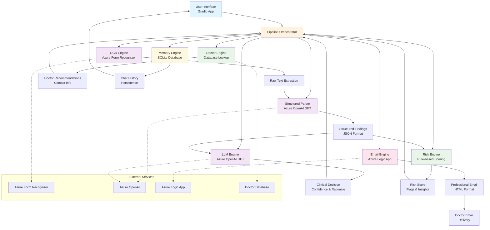

# Healthcare Assistant

A comprehensive AI-powered healthcare assistant designed to analyze medical lab reports, extract key findings, provide clinical evaluations, assess risks, suggest specialists, and facilitate secure doctor-patient communication via email. Built with modern AI technologies and a user-friendly interface for seamless medical data processing.

## Table of Contents

- [Features](#features)
- [Architecture](#architecture)
- [Technology Stack](#technology-stack)
- [Installation](#installation)
- [Configuration](#configuration)
- [Usage](#usage)
- [Project Structure](#project-structure)
- [API Reference](#api-reference)
- [Testing](#testing)
- [Contributing](#contributing)
- [License](#license)
- [Disclaimer](#disclaimer)

## Features

### Medical Report Analysis
- **OCR Processing**: Extracts text from multi-page PDF medical reports using Azure Form Recognizer
- **Structured Data Extraction**: Uses advanced LLM to parse and structure lab test results from any format
- **Intelligent Parsing**: Handles various report layouts, units, and reference ranges automatically

### AI Clinical Evaluation
- **Decision Support**: Provides conservative medical decision-making (consult/no-consult/uncertain)
- **Confidence Scoring**: Quantifies AI confidence in recommendations
- **Specialty Suggestions**: Recommends appropriate medical specialties based on findings

### Risk Assessment
- **Dynamic Scoring**: Calculates risk scores (0-100) based on abnormal findings
- **Flag Detection**: Identifies critical abnormalities and flags
- **Domain Insights**: Provides specialized insights (e.g., Vitamin D + PTH correlations)

### Doctor Recommendations
- **Specialty Matching**: Suggests doctors based on required medical specialties
- **Contact Integration**: Provides doctor contact information for referrals

### Secure Communication
- **Professional Email Generation**: Creates HTML-formatted reports for doctor communication
- **Patient Consent Flow**: Manages email sharing with user confirmation
- **Azure Logic App Integration**: Secure email delivery through enterprise-grade services

### Interactive Chat Interface
- **Gradio UI**: Modern, responsive web interface
- **Memory Persistence**: Maintains conversation history across sessions
- **Multimodal Input**: Supports both text queries and file uploads
- **General Health Queries**: Answers medical questions with context from uploaded reports

### Pipeline Orchestration
- **Modular Design**: Clean separation of concerns with independent engines
- **Error Handling**: Robust error management and fallback mechanisms
- **Scalable Architecture**: Designed for easy extension and maintenance

## Architecture

The system follows a modular pipeline architecture with independent engines communicating through a central orchestrator.



### Architecture Components

#### Core Engines
- **OCR Engine**: Handles document text extraction with retry logic and error handling
- **Structured Parser**: LLM-powered extraction of lab values, units, and reference ranges
- **LLM Engine**: Clinical decision support with confidence scoring and specialty recommendations
- **Risk Engine**: Rule-based risk assessment with domain-specific insights
- **Doctor Engine**: Specialty-based doctor lookup and contact retrieval
- **Memory Engine**: SQLite-based chat history management
- **Email Engine**: Professional email generation and delivery via Azure Logic Apps

#### Data Flow
1. **Input Processing**: User uploads PDF or enters query through Gradio interface
2. **Text Extraction**: OCR engine converts document to machine-readable text
3. **Data Structuring**: Parser extracts structured lab findings from raw text
4. **Clinical Analysis**: LLM evaluates findings and provides decision support
5. **Risk Assessment**: Risk engine calculates scores and identifies abnormalities
6. **Recommendations**: Doctor engine suggests appropriate specialists
7. **Communication**: Email engine facilitates secure doctor-patient communication
8. **Memory**: All interactions are logged for context and continuity

## 🛠️ Technology Stack

### Core Technologies
- **Python 3.8+**: Primary programming language
- **Gradio**: Modern web UI framework
- **Azure OpenAI**: GPT models for clinical analysis and parsing
- **Azure Form Recognizer**: OCR and document intelligence
- **Azure Logic Apps**: Secure email delivery
- **SQLite**: Local database for chat memory

### Key Libraries
- **OpenAI SDK**: Azure OpenAI integration
- **Azure AI Form Recognizer**: Document processing
- **Pandas**: Data manipulation
- **Requests**: HTTP client for Logic Apps
- **python-dotenv**: Environment variable management
- **Pillow**: Image processing support

### Development Tools
- **pytest**: Testing framework
- **Black**: Code formatting
- **Flake8**: Linting
- **Git**: Version control

## Installation

### Prerequisites
- Python 3.8 or higher
- Azure subscription with access to:
  - Azure OpenAI Service
  - Azure Form Recognizer
  - Azure Logic Apps (optional, for email)
- Git

### Clone Repository
```bash
git clone https://github.com/yourusername/healthcare-assistant.git
cd healthcare-assistant
```

### Environment Setup
1. Create virtual environment:
```bash
python -m venv venv
source venv/bin/activate  # On Windows: venv\Scripts\activate
```

2. Install dependencies:
```bash
pip install -r requirements.txt
```

3. Configure environment variables:
```bash
cp .env.example .env
# Edit .env with your Azure credentials
```

## Configuration

### Required Environment Variables
```env
# Azure OpenAI Configuration
AZURE_OPENAI_ENDPOINT=https://your-resource.openai.azure.com/
AZURE_OPENAI_KEY=your-openai-api-key
AZURE_OPENAI_DEPLOYMENT=your-gpt-deployment-name

# Azure Form Recognizer
AZURE_FORM_RECOGNIZER_ENDPOINT=https://your-form-recognizer.cognitiveservices.azure.com/
AZURE_FORM_RECOGNIZER_KEY=your-form-recognizer-key

# Azure Foundry (for structured parsing)
AZURE_FOUNDRY_ENDPOINT=https://your-foundry.openai.azure.com/
AZURE_FOUNDRY_KEY=your-foundry-api-key
AZURE_FOUNDRY_DEPLOYMENT=your-foundry-deployment-name
AZURE_FOUNDRY_API_VERSION=2024-02-15-preview

# Email Configuration (Optional)
LOGIC_APP_URL=https://your-logic-app-url
DOCTOR_DEFAULT_EMAIL=doctor@example.com
DEFAULT_USER_EMAIL=user@example.com
```

### Optional Configuration
- **Doctor Database**: Configure `doctor_setup.py` with your doctor directory
- **Memory Settings**: Adjust SQLite database path in `memory_engine.py`
- **UI Customization**: Modify themes and CSS in `app.py`

## Usage

### Starting the Application
```bash
python app.py
```

The application will launch at `http://localhost:7860` by default.

### Basic Workflow

1. **Upload Report**: Click "Upload" and select a medical lab report PDF
2. **AI Analysis**: The system automatically processes the document and extracts findings
3. **Review Results**: Examine the structured findings table and AI evaluation
4. **Doctor Communication**: Choose to email the summary to a suggested doctor
5. **Follow-up Chat**: Ask general health questions with report context

### Chat Interface Features

- **File Upload**: Drag-and-drop PDF files or click to browse
- **Text Queries**: Ask health-related questions
- **Memory**: Conversation history persists across sessions
- **Email Flow**: Guided process for sharing reports with doctors

### API Usage (Programmatic)

```python
from pipeline import analyze_medical_report

# Analyze a medical report
result = analyze_medical_report("path/to/report.pdf")

# Access results
findings = result["findings"]
decision = result["llm_output"]["decision"]
doctors = result["doctors"]
risk_score = result["risk"]["score"]
```

## Project Structure

```
healthcare-assistant/
├── app.py                 # Main Gradio application
├── pipeline.py            # Core analysis pipeline
├── requirements.txt       # Python dependencies
├── .env                   # Environment variables (not committed)
├── .gitignore            # Git ignore rules
├── README.md             # This file
│
├── engines/              # Core processing engines
│   ├── ocr_engine.py     # Document text extraction
│   ├── structured_parser.py  # Lab data structuring
│   ├── llm_engine.py     # Clinical decision support
│   ├── risk_engine.py    # Risk assessment
│   ├── doctor_engine.py  # Doctor recommendations
│   ├── memory_engine.py  # Chat persistence
│   └── email_engine.py   # Email communication
│
├── tests/                # Test files
│   ├── test.py           # Main test suite
│   ├── parser_test.py    # Parser engine tests
│   ├── llm_test.py       # LLM engine tests
│   └── ocr_test.py       # OCR engine tests
│
├── utils/                # Utility modules
│   ├── check_env_and_connect.py  # Environment validation
│   ├── init_memory.py    # Database initialization
│   └── doctor_setup.py   # Doctor database setup
│
└── docs/                 # Documentation (future)
    └── api.md
```

## API Reference

### Core Functions

#### `analyze_medical_report(file_path)`
Main pipeline function that processes a medical report.

**Parameters:**
- `file_path` (str): Path to PDF medical report

**Returns:**
```json
{
  "raw_text": "extracted text content",
  "findings": [
    {
      "name": "Hemoglobin",
      "value": 12.5,
      "unit": "g/dL",
      "ref_low": 12.0,
      "ref_high": 16.0,
      "interpretation": "normal"
    }
  ],
  "llm_output": {
    "decision": "no_consult",
    "confidence": 0.85,
    "rationale": "All values within normal range",
    "suggested_specialty": "general_physician"
  },
  "doctors": [
    {
      "name": "Dr. Sarah Johnson",
      "specialty": "General Physician",
      "contact": "sarah.johnson@hospital.com"
    }
  ],
  "risk": {
    "score": 15,
    "flags": [{"test": "Vitamin D", "flag": "low"}],
    "insights": ["Consider Vitamin D supplementation"]
  }
}
```

#### `extract_text_from_file(file_path)`
Extracts text content from PDF documents.

#### `extract_structured_labs(raw_text)`
Parses raw text into structured lab findings.

#### `analyze_findings(findings)`
Performs clinical evaluation of lab results.

#### `compute_risk_and_insights(findings)`
Calculates risk scores and provides insights.

#### `get_doctors_by_specialty(specialty)`
Retrieves doctor recommendations.

#### `send_report_email(to_email, subject, body)`
Sends professional email reports.

## Testing

### Running Tests
```bash
# Run all tests
python -m pytest

# Run specific test file
python -m pytest tests/test.py

# Run with coverage
python -m pytest --cov=. --cov-report=html
```

### Test Coverage
- **OCR Engine**: Document processing and error handling
- **Parser Engine**: Structured data extraction accuracy
- **LLM Engine**: Clinical decision-making validation
- **Risk Engine**: Scoring algorithm verification
- **Memory Engine**: Database operations
- **Email Engine**: Communication functionality
- **Pipeline Integration**: End-to-end workflow testing

### Sample Test Data
Test files are located in the `tests/` directory with sample medical reports and expected outputs.

## Contributing

We welcome contributions! Please follow these guidelines:

### Development Setup
1. Fork the repository
2. Create a feature branch: `git checkout -b feature/your-feature`
3. Make your changes
4. Add tests for new functionality
5. Ensure all tests pass: `python -m pytest`
6. Commit your changes: `git commit -am 'Add new feature'`
7. Push to the branch: `git push origin feature/your-feature`
8. Submit a pull request

### Code Standards
- Follow PEP 8 style guidelines
- Use type hints for function parameters
- Add docstrings to all functions
- Write comprehensive unit tests
- Update documentation for API changes

### Areas for Contribution
- **Medical Knowledge**: Enhance clinical decision rules
- **UI/UX**: Improve the Gradio interface
- **Performance**: Optimize processing speed
- **Security**: Enhance data privacy measures
- **Internationalization**: Support multiple languages
- **Integration**: Add support for additional medical systems

## License

This project is licensed under the MIT License - see the [LICENSE](LICENSE) file for details.

## Disclaimer

**This software is for educational and research purposes only. It is NOT a substitute for professional medical advice, diagnosis, or treatment.**

### Important Notes
- **Not FDA Approved**: This tool is not intended for clinical use
- **AI Limitations**: AI analysis may contain errors or biases
- **Professional Consultation**: Always consult qualified healthcare providers
- **Data Privacy**: Ensure compliance with HIPAA and local privacy regulations
- **Emergency Situations**: Seek immediate medical attention for emergencies

### Liability
The developers and contributors are not liable for any damages or consequences arising from the use of this software. Users assume all responsibility for their application of the analysis results.

---

**Built with ❤️ for safer, smarter healthcare decisions**
